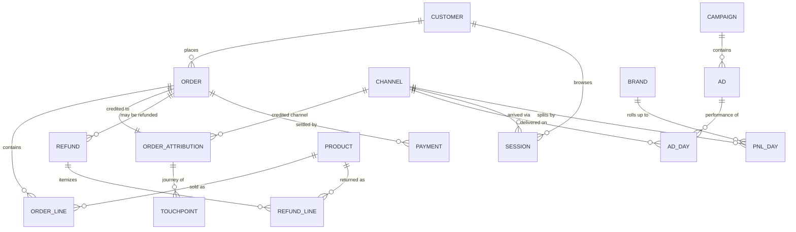
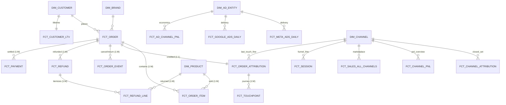

# Data Model — Conceptual · Logical · Physical

Status: **reference model**, 2026-09-26. Canonical three-tier description of the
Seleric analytics model the agentic system resolves against.

- **Conceptual** (Part I) — the business: entities, concepts, rules. No technology.
- **Logical** (Part II) — the structure: facts, conformed dimensions, keys,
  relationships. Platform-agnostic star schema.
- **Physical** (Part III) — the implementation: ClickHouse gold → serve VIEWs →
  Cube cubes → Cube views, with real tables, types, keys and conventions.

Rationale, the query-resolution diagnosis, the Concept Layer, and the migration
plan live in `LOGICAL_DATA_MODEL_DESIGN.md` — this doc is the *model itself*, not
the argument for it. Governance lives in `catalogue/SERVE_LAYER_ARCHITECTURE.md`.

Each layer maps down to the next:

```
Concept (Revenue, Orders, …)              Part I — what a question is about
  │ resolves via axes to a measure
Logical fact.measure + conformed dims     Part II — how it is structured
  │ binds to
Cube view.member → serve relation → gold  Part III — where it physically lives
```

---

# Part I — Conceptual Model

## I.1 Subject areas (domains)

| Domain | Business question it answers | Core entities |
|---|---|---|
| **Commerce** | What did we sell, for how much, net of returns? | Order, Order Event |
| **Product** | Which SKUs sell, at what margin? | Order Line, Product |
| **Attribution** | Which channel/campaign drove the sale? | Order Attribution, Touchpoint |
| **Paid Media** | How are Meta/Google ads delivering & performing? | Ad, Campaign, Ad-day |
| **Finance** | What is the P&L — profit, COGS, ROAS, MER? | P&L Day, Channel P&L |
| **Customer** | Who buys, repeats, and at what LTV? | Customer, Purchase Sequence |
| **Web / Funnel** | How do sessions convert on-site? | Session, Web Event |
| **Operations** | What is returned/refunded and what does it cost? | Refund, Refund Line |

## I.2 Core business entities



Entities are **technology-agnostic**: an *Order* is a business fact whether it
lives in Shopify, ClickHouse, or Cube. `BRAND` is the tenant; every entity is
scoped by it.

## I.3 Business concepts (what questions ask for)

Questions name **concepts**, not tables: *Revenue, Sales, Orders, Profit, Margin,
COGS, Discounts, Returns/Cancels, Taxes, Contribution, AOV, ASP, Units, Ad Spend,
ROAS, MER, CAC, LTV, LTV:CAC, Attributed Revenue/Orders, Customers, Repeat Rate,
Impressions/Clicks/CTR/CPC/CPM, Reach/Frequency, Sessions, Conversion Rate, Web
Engagement, Attribution Quality* (28; full definitions in
`LOGICAL_DATA_MODEL_DESIGN.md §8`). A concept resolves to exactly one logical
measure once its **axes** are chosen (basis / scope / attribution / platform /
grain).

## I.4 Governing business rules

1. **Grain is sacred.** A measure is only valid at its own grain; parts below it do
   not re-sum to the whole (order vs line-item vs ad-day).
2. **Basis must be explicit.** *net* (ex-GST, after discounts/returns) vs *gross*
   (ex-GST, pre-discount) vs *total* (incl-GST). The GST boundary is the single
   largest source of wrong answers.
3. **Attribution is an axis, not a fact.** Commerce (no attribution), last-touch,
   and channel readings of "revenue" legitimately differ (~20%) and do **not**
   reconcile — they answer different questions.
4. **Channel is a dimension, not a name.** Meta/Google/WhatsApp/… are *values*
   of the channel dimension, discovered from data — never baked into a metric.
5. **All-channels is the topline default.** Bare financial terms mean the
   all-channels P&L number (the dashboard headline); Shopify-only needs a qualifier.

---

# Part II — Logical Model

Star schema: **conformed dimensions** shared by FK across **fact tables**, one fact
per grain. Legend: **PK** key part · **FK** foreign key · *(m)* measure.

## II.1 Conformed dimensions

| Dimension | Key | Key attributes |
|---|---|---|
| **DIM_BRAND** | brand_id | brand_name, currency (tenant) |
| **DIM_DATE** | date | year, quarter, month, week, day_of_week (query-layer calendar) |
| **DIM_CUSTOMER** | brand_id, customer_id | email_hash, acquisition_platform/channel/campaign, first/last_order_at, default_city/province/country, is_repeat_customer, lifetime_order_count_band, marketing states |
| **DIM_PRODUCT** | brand_id, variant_id | product_id, sku, product_title, variant_title, product_type, vendor |
| **DIM_AD_ENTITY** | brand_id, ad_id | ad_account_id, campaign_id/name/objective/status, adset_id/name/status/optimization_goal, ad_name/status/format, creative_id/name/cta, budgets, neurohack_tag_codes, platform |
| **DIM_CHANNEL** | channel_type, channel_value | description, parent_channel (hierarchy) |
| **DIM_PAYMENT** | payment_method | payment_gateway, payment_bucket, is_cod, is_prepaid |
| **DIM_GEOGRAPHY** | (shipping_country, region, city, pincode, state_code) | geo attributes |

`DIM_CHANNEL.channel_type` ∈ {attribution_closed_set, last_touch_fine,
marketplace, funnel_fine, pnl_overview}; `channel_value` is **data-driven and
open** (meta/google/whatsapp/organic/unattributed…) with a hierarchy
platform → channel → placement → ad (see `LOGICAL_DATA_MODEL_DESIGN.md §9`).

## II.2 Fact tables

| Fact | Grain (PK) | Key measures (m) | FK dimensions |
|---|---|---|---|
| **FCT_ORDER** | brand_id, order_id | orders, total_sales, gross_sales_excl_tax, dashboard_net_sales_excl_tax, net_revenue_excl_tax, discount_amount_excl_tax, total_refund_amount, aov, cod/prepaid/new_customer_orders | date, customer, payment, geography |
| **FCT_ORDER_EVENT** | brand_id, order_id, event_type | cancelled_orders, returned_orders, cancel_revenue_excl_tax, return_revenue_excl_tax | date(event_date), order |
| **FCT_ORDER_ITEM** | brand_id, order_id, line_item_id | units_sold, total_quantity, net_line_revenue_ex_gst, product_cogs, gross_profit_ex_gst, product_gross_margin_pct, returned/cancelled_units, product_return/cancel_revenue | product, order, date |
| **FCT_ORDER_ATTRIBUTION** | brand_id, order_id (1:1 order) | attributed_orders, attributed_net_revenue, attributed_gross_revenue, attributed_refund_amount, attributed_aov, attribution_rate, new_customer_orders | channel(lt_channel), date |
| **FCT_TOUCHPOINT** | brand_id, order_id, touch_id | touches, distinct_orders, avg_touch_count | order, channel |
| **FCT_CHANNEL_ATTRIBUTION** | brand_id, report_date, channel | orders, new_customer_orders, unattributed_orders, gross_revenue, net_revenue_excl_tax | channel(closed_set), date |
| **FCT_META_ADS_DAILY** | brand_id, report_date, ad_id (+hour/breakdown variants) | meta_spend, impressions, clicks, link_clicks, reach*, thruplays, ctr/cpc/cpm, hook/hold rate | ad_entity, date, channel |
| **FCT_GOOGLE_ADS_DAILY** | brand_id, report_date, campaign_id (+hour) | google_spend, impressions, clicks, ctr/cpc/cpm | ad_entity, date |
| **FCT_AD_CHANNEL_PNL** | brand_id, report_date, channel, campaign_id, adset_id, ad_id | ad_spend, net_sales, net_profit, net_roas, orders, impressions, clicks | ad_entity, channel, date |
| **FCT_AD_STATUS_HISTORY** | brand_id, entity_type, entity_id, changed_at | status_changes, budget_changes | ad_entity |
| **FCT_CANONICAL_PNL** | brand_id, report_date | orders, net_sales, gross_sales, discounts, return/cancel_revenue, taxes, net_cogs, product_cost, operating_cost (+ship/pack/gateway/rto), meta/google/total_ad_spend, gross_profit, contribution_margin, net_profit(_all_channels), *_margin_pct, mer, *_roas | brand, date |
| **FCT_CHANNEL_PNL** | brand_id, report_date, channel | net_sales, net_profit, ad_spend, net_roas (+ meta/google/organic wide) | channel(pnl_overview), date |
| **FCT_FINANCE_WATERFALL** | brand_id, report_date, waterfall_key | line_net_revenue_excl_gst, line_net_cogs, line_gross/net_profit, line_marketing | brand, date |
| **FCT_PAYMENT** | brand_id, transaction_id | transactions, payment_amount, amount_signed, successful_transactions | order, date, payment |
| **FCT_REFUND** | brand_id, refund_id | refund_count, refunded_amount(_excl_tax), returns_excl_tax, refunded_quantity, restock_rate | order, date, payment, geography |
| **FCT_REFUND_LINE** | brand_id, refund_line_item_id | refund_lines, refunded_units, refunded_amount_excl_tax, recovered_cogs, rto_cost_refund | refund, product, date |
| **FCT_CUSTOMER_LTV** | brand_id, customer_id | customers, repeat_customers, lifetime_net/gross_revenue, lifetime_orders, avg_ltv, repeat_rate | customer |
| **FCT_PURCHASE_SEQUENCE** | brand_id, order_id | first_orders, repeat_orders, net_revenue, avg_days_between_orders | customer, date |
| **FCT_LTV_CAC** | brand_id, report_date | new_customers, new_customer_revenue, total_ad_spend, ltv, cac, ltv_cac_ratio | brand, date |
| **FCT_SESSION** | brand_id, session_id | sessions, engaged/pdp/atc/checkout/purchased_sessions, purchase_revenue, product_views, add_to_carts, conversion_rate, bounce_rate | channel(funnel_fine), date |
| **FCT_WEB_EVENT** | brand_id, event_date, event_type | events, page/product/collection_views, add_to_cart/purchase_events, unique_sessions, event_revenue | channel, date, product |
| **FCT_SALES_ALL_CHANNELS** | brand_id, report_date, channel | total_sales, gross_sales, net_sales (+ shopify_*) | channel(marketplace), date |

*reach/frequency are **non-additive** — never `sum`.* Daily rollups
(`commerce_performance`, `funnel_daily`, `web_events_daily`,
`returns_cancels_all_channels`, `orders_all_channels`) are coarser-grain
projections of the facts above, not separate entities.

## II.3 Relationships (cardinality)



**Fan-out rule:** a fact may pull attributes from a dimension reached 1:1 or M:1
freely; it must **never** pull a measure across a 1:M without re-grouping.
`FCT_ORDER → FCT_ORDER_ITEM` is the canonical 1:M trap (line revenue over-sums
order revenue by items/order).

## II.4 Concept → logical binding (head)

| Concept | Axes | Logical fact.measure |
|---|---|---|
| Revenue | net, company | FCT_CANONICAL_PNL.net_sales_all_channels |
| Revenue | last_touch | FCT_ORDER_ATTRIBUTION.attributed_net_revenue |
| Revenue | channel | FCT_CHANNEL_ATTRIBUTION.net_revenue_excl_tax |
| Orders | none, company | FCT_ORDER.orders |
| Profit | net, all_channels | FCT_CANONICAL_PNL.net_profit_all_channels |
| Ad Spend | platform=meta | FCT_AD_CHANNEL_PNL.ad_spend WHERE channel=meta |
| ROAS | net, company | FCT_CANONICAL_PNL.net_roas_all_channels |

Full table: `LOGICAL_DATA_MODEL_DESIGN.md §8`.

---

# Part III — Physical Model

## III.1 Platform & layering

```
ClickHouse gold (78 tables)   facts + dims, ReplacingMergeTree, GST/basis resolved
  → serve (41 relations)      ClickHouse VIEWs, one per output port (no materialization)
  → Cube cubes (41)           public:false; measures/dimensions with type+format
  → Cube views (37 exposed)   the certified query surface the agent hits
```

- **Storage engine:** gold is `ReplacingMergeTree` throughout → reads must use
  `FINAL` (or `argMax(...) GROUP BY key`) or they see unmerged duplicate parts.
- **Serve relations are VIEWs** (no refresh pipeline) — always-current, but wide
  joined relations re-execute dimension joins on every query (materialization
  recommended for 2+-join relations; see SERVE_LAYER_ARCHITECTURE §2.4).
- **Cubes are `public: false`** — only Cube *views* are queryable. Agents never
  hit a cube or a gold/serve table directly.
- **No pre-aggregations** today — every query is live against serve.

## III.2 Physical type conventions

| Logical kind | ClickHouse type | Cube type |
|---|---|---|
| brand_id, order_id, *_id, names, statuses | `String` (LowCardinality where applicable) | `string` |
| order_date, report_date, event_date, refund_date | `Date` | `time` |
| order_created_at_ist, changed_at, *_ts | `DateTime`/`DateTime64` (IST) | `time` |
| money (sales, cogs, spend, profit) | `Decimal(18,4)` / `Float64` | `sum`/`number`, format `currency` |
| counts (orders, units, impressions) | `UInt*` | `count` / `count_distinct` / `sum`, format `number` |
| rates/ratios (ctr, margin_pct, roas, aov) | `Float64` (derived) | `number` |
| flags (is_cod, is_new_customer, is_final) | `UInt8` | `boolean` |

Types are the model convention; the authoritative per-member type is the Cube
`/meta` endpoint (validated at load by `catalogue_service/validate.py`).

## III.3 Logical entity → physical binding

| Logical fact/dim | Cube view | serve relation (`sql_table`) | gold source | date axis |
|---|---|---|---|---|
| FCT_ORDER (+ EVENT) | `commerce_orders` | serve.commerce_orders (+ commerce_order_events) | gold.fct_orders FINAL | order_date / event_date |
| daily commerce rollup | `commerce_performance` | serve.commerce_performance_daily | gold.fct_orders | report_date |
| FCT_ORDER_ITEM | `product_performance` | serve.product_performance | gold.fct_order_items FINAL | order_date |
| FCT_ORDER_ATTRIBUTION | `order_attribution` | serve.order_attribution (argMax dedup) | gold.fct_order_attribution FINAL | order_date |
| FCT_TOUCHPOINT | `touchpoints` | serve.touchpoints | gold.fct_touchpoints FINAL | order_date |
| attribution journeys | `attribution_paths` | serve.attribution_paths | gold.fct_attribution_paths FINAL | order_date |
| FCT_META_ADS_DAILY | `meta_ad_performance` (+`_hourly`,`_breakdown_performance`) | serve.meta_ads_daily / _hourly / _breakdown_daily | gold.fct_meta_ads_daily / mart_meta_ad_breakdown_daily | report_date |
| FCT_GOOGLE_ADS_DAILY | `google_ad_performance` (+`_hourly`) | serve.google_ads_daily / _hourly | gold.fct_google_ads_daily | report_date |
| meta ad-day attribution | `meta_ad_attribution` | serve.meta_ad_attribution_daily | gold.mart_meta_ad_daily_attribution | report_date |
| FCT_AD_CHANNEL_PNL | `ad_channel_pnl` | serve.ad_channel_pnl_daily | (commerce + attribution + ads) | report_date |
| FCT_CHANNEL_ATTRIBUTION | `channel_attribution` | serve.channel_attribution_daily | (channel attribution daily) | report_date |
| FCT_CHANNEL_PNL | `channel_pnl` | serve.channel_pnl (argMax dedup) | commerce + order_events + fct_order_attribution | report_date |
| platform commerce attr | `platform_attribution_commerce` | serve.platform_attribution_commerce | commerce LEFT JOIN fct_order_attribution | report_date |
| FCT_CANONICAL_PNL | `canonical_pnl` (alias `daily_pnl`) | serve.canonical_pnl | commerce oracle + Net COGS + ad spend | report_date |
| FCT_FINANCE_WATERFALL | `finance_waterfall` | serve.finance_waterfall_daily | gold finance waterfall | report_date |
| FCT_PAYMENT | `payments` | serve.payments | gold.fct_payments | transaction_date |
| FCT_REFUND | `refund_events` | serve.refund_events | gold.fct_refunds FINAL | refund_date |
| FCT_REFUND_LINE | `return_lifecycle` | serve.return_lifecycle | gold.fct_refund_line_items FINAL | refund_date |
| FCT_CUSTOMER_LTV / DIM_CUSTOMER | `customer_ltv` / `customer_data` | serve.customer_ltv / serve.customer_data | gold.fct_orders + dim_customers | last_order_at / — |
| FCT_PURCHASE_SEQUENCE | `purchase_sequence` | serve.purchase_sequence | gold.fct_orders FINAL | order_date |
| FCT_LTV_CAC | `ltv_cac` | serve.ltv_cac | fct_order_attribution + ads | report_date |
| FCT_SESSION | `session_funnel` | serve.session_funnel | gold.fct_session_funnel FINAL | session_date |
| daily funnel | `funnel_daily` | serve.funnel_daily | gold.mart_funnel_daily FINAL | report_date |
| FCT_WEB_EVENT | `web_events` / `web_events_daily` | serve.web_events / _daily | gold.fct_web_events / mart_web_events_daily | event_date / report_date |
| FCT_AD_STATUS_HISTORY | `meta_ads_status_history` / `google_ads_status_history` | serve.*_status_history | gold.fct_*_ads_status_history | changed_at |
| FCT_SALES_ALL_CHANNELS | `sales_all_channels` / `orders_all_channels` / `returns_cancels_all_channels` | serve.commerce_orders / commerce_order_events | gold.fct_orders | report_date |

## III.4 Column-level spec — core facts (representative)

Full column lists are in `data_platform/mage-ai/infra/cube/model/views/serve_views.yml`
and each cube in `.../model/cubes/serve_*.yml`. Core facts:

**commerce_orders** (`serve.commerce_orders`, VIEW over `gold.fct_orders` FINAL) — grain brand_id×order_id
| Column | CH type | Cube | Role |
|---|---|---|---|
| brand_id | String | string | PK/FK |
| order_id, order_name | String | string / count_distinct(`orders`) | PK |
| order_date | Date | time | date axis |
| order_created_at_ist | DateTime | time | datetime axis |
| total_sales (`total_sales_incl_tax`) | Decimal | sum, currency | m (basis=total) |
| gross_sales_excl_tax | Decimal | sum, currency | m (basis=gross) |
| dashboard_net_sales_excl_tax | Decimal | sum, currency | m (order-grain net; use daily for topline) |
| net_revenue_excl_tax | Decimal | sum, currency | m |
| discount_amount_excl_tax | Decimal | sum, currency | m |
| aov | Decimal | number, currency | m (derived) |
| is_commerce_placement_order | UInt8 | boolean | measure guard (excludes test/adjustment) |
| payment_method / bucket / gateway, is_cod, is_prepaid | String/UInt8 | string/boolean | FK DIM_PAYMENT |
| shipping_country/region/city/pincode/state_code | String | string | FK DIM_GEOGRAPHY |
| is_new_customer | UInt8 | boolean | flag |
| *joined 1:M* → serve.commerce_order_events: cancelled_orders, returned_orders, cancel_revenue_excl_tax, return_revenue_excl_tax, event_date, event_type |

**order_attribution** (`serve.order_attribution`, argMax dedup over `gold.fct_order_attribution`) — grain brand_id×order_id (1:1 order)
| Column | CH type | Cube | Role |
|---|---|---|---|
| brand_id, order_id, touch_id | String | string / countDistinct(`attributed_orders`) | PK |
| order_date | Date | time | date axis |
| credited_net_revenue_excl_tax | Decimal | sum (`attributed_net_revenue`) | m |
| credit_pct | Float64 | — | credit weight |
| lt_platform, lt_channel | String | string | FK DIM_CHANNEL (last_touch_fine) |
| lt_campaign_id/name, lt_adset_name, lt_ad_name | String | string | attribution keys |
| attribution_method, attribution_model | String | string | attribution axis |
| attribution_confidence | Float64 | number | quality |
| is_new_customer, is_cod, is_prepaid | UInt8 | boolean | flags |
| is_final, model_version | UInt8/String | — | provenance |

**canonical_pnl** (`serve.canonical_pnl`) — grain brand_id×report_date (P&L spine)
| Column | CH type | Cube | Role |
|---|---|---|---|
| brand_id, report_date | String/Date | string/time | PK |
| net_sales, gross_sales, discounts, taxes_on_net_sales | Decimal | sum, currency | m (Shopify basis) |
| net_sales_all_channels_pnl, net_profit_all_channels | Decimal | sum, currency | m (all-channels topline) |
| net_cogs, product_cost, operating_cost, shipping/packaging/rto_cost, payment_gateway_fees | Decimal | sum, currency | m (identity: net_cogs = product_cost + operating_cost) |
| meta_spend, google_spend, total_ad_spend, shopify_ad_spend | Decimal | sum, currency | m (**wide channel cols — spine only; demote to aliases, §III.6**) |
| gross_profit, contribution_margin, net_profit | Decimal | sum, currency | m (net_profit = contribution_margin − total_ad_spend) |
| gross/net_margin_pct, mer, *_roas | Float64 | number | m (derived) |
| is_final, source_basis, model_version | UInt8/String | — | provenance |

**ad_channel_pnl** (`serve.ad_channel_pnl_daily`) — grain brand_id×report_date×channel×campaign×adset×ad
| Column | CH type | Cube | Role |
|---|---|---|---|
| brand_id, report_date | String/Date | string/time | PK |
| channel | String | string | **FK DIM_CHANNEL (the extensible axis — meta/google/…)** |
| campaign_id, adset_id, ad_id (+names) | String | string | PK / FK DIM_AD_ENTITY |
| row_type | String | string | detail vs total (filter to detail for breakdowns) |
| ad_spend, net_sales, net_profit, orders, impressions, clicks | Decimal/UInt | sum | m |
| net_roas, ctr | Float64 | number | m (derived) |
| is_unattributed | UInt8 | boolean | catch-all bucket |

## III.5 Physical conventions & provenance

- **FINAL discipline** — every serve VIEW reads gold with `FINAL` or `argMax(...)
  GROUP BY key` (order_attribution, channel_pnl). Non-negotiable given
  `fct_order_items` runs ~81 parts, `fct_orders` ~63.
- **Provenance columns** on serve relations: `is_final` (report_date ≤ today−3),
  `source_basis`, `model_version`, and where present `data_as_of` — the freshness
  gate reads these to fail closed on stale data.
- **Composite primary keys** are synthesized on inline-SQL bridge cubes
  (`concat(brand_id,'|',report_date,'|',channel)` etc.) so Cube can dedupe.
- **Non-additive measures** (reach, frequency, distinct counts, rates) are typed
  `count_distinct`/`number`, never `sum` — enforced by `check_data_quality.py`.
- **Dead physical columns excluded from the logical model** (0%-populated):
  commerce UTMs, session device/browser/os, breakdown country/impression_device,
  `accepts_marketing`; recent Meta `creative_*` (upstream regression) — see
  SERVE_LAYER_ARCHITECTURE §9.2.

## III.6 Physical channel handling (extensibility)

- **Long, channel-keyed facts** carry channel as a dimension **column**
  (`ad_channel_pnl.channel`, `channel_attribution.channel`,
  `sales_all_channels.channel`) → a new channel (WhatsApp) is a new **row**, no DDL.
- **Wide per-channel columns** (`canonical_pnl.meta_spend/google_spend`,
  `channel_pnl.meta_*/google_*/organic_*`) exist **only** on fixed P&L relations
  and should be **derived from the long facts**, not authored per channel. Their
  catalogue metrics (`meta_spend`, `google_spend`, `meta_attribution_net_sales`, …)
  are **compat aliases** that expand to `(channel-keyed metric, channel=X)`.
- **Channel normalization** (`catalogue/dimensions/channel_map.yaml`, proposed):
  raw source → canonical channel + channel_type + parent. Adding a channel = one
  map entry + loader rows; a mandatory `unattributed` catch-all guarantees no
  revenue is dropped. Full design: `LOGICAL_DATA_MODEL_DESIGN.md §9`.

---

### Appendix — source files

- Physical: `data_platform/mage-ai/infra/cube/model/views/serve_views.yml` (37 views),
  `.../model/cubes/serve_*.yml` (41 cubes), `catalogue/views.yaml` (date axis + lineage).
- Logical/semantic: `catalogue/metrics/*.yaml` (185), `catalogue/dimensions/core.yaml` (125),
  `catalogue/glossary/terms.yaml`, `catalogue/openmetadata/ontology.yaml`.
- Companion: `LOGICAL_DATA_MODEL_DESIGN.md` (diagnosis, Concept Layer, channel extensibility, migration),
  `catalogue/SERVE_LAYER_ARCHITECTURE.md` (governance), `catalogue/CANONICAL_DATA_MODEL.md` (gold facts/dims).
