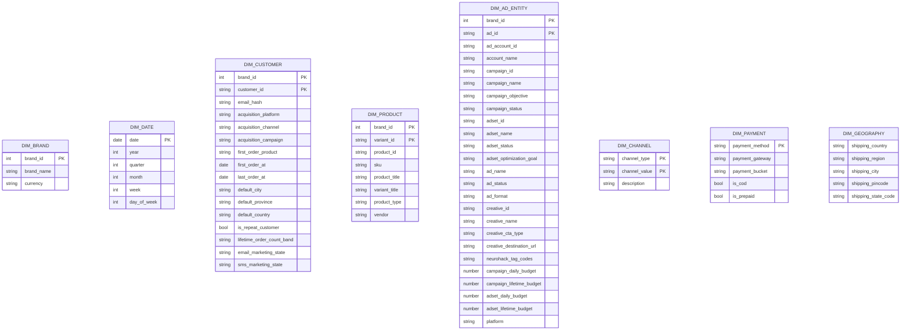
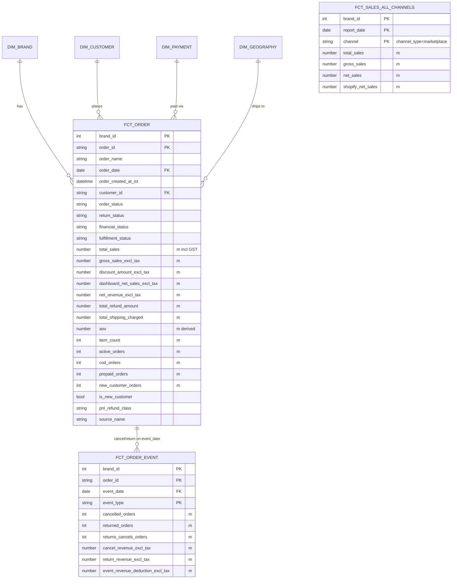
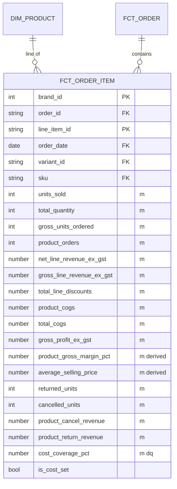
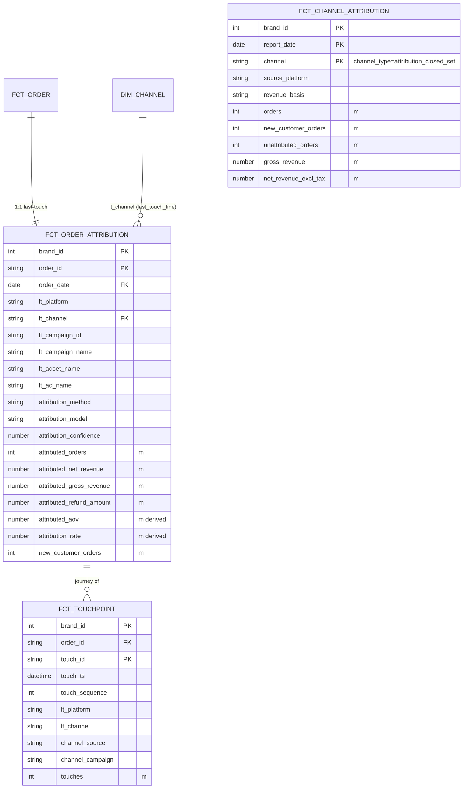
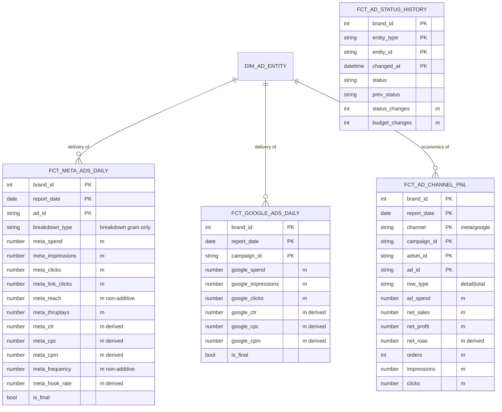
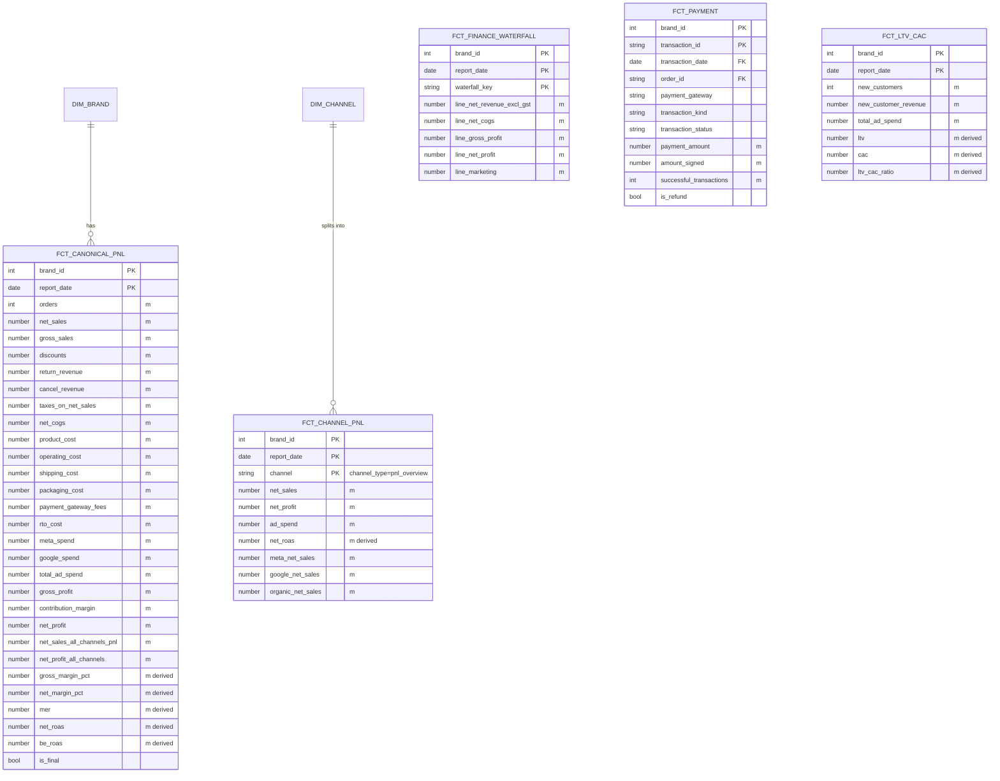
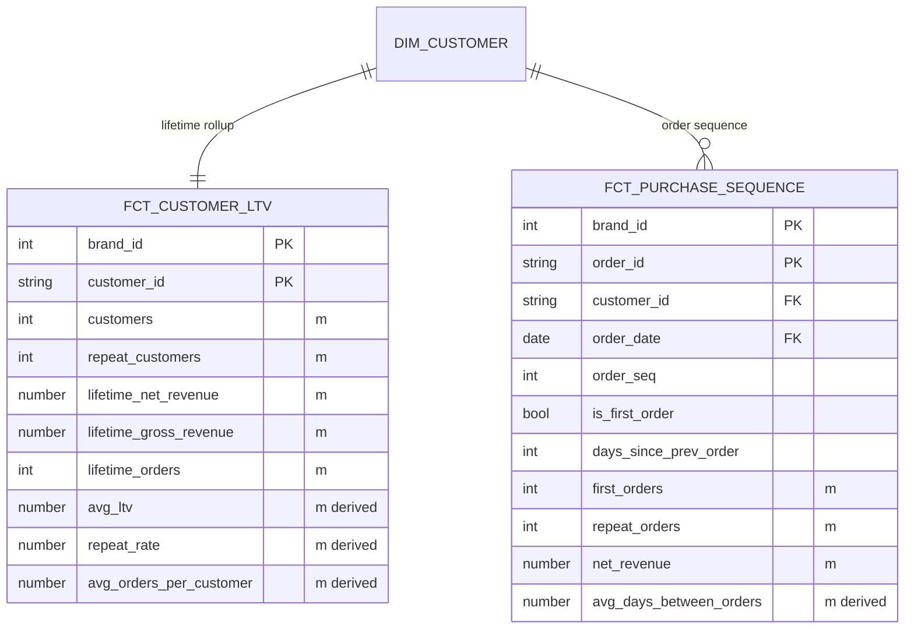
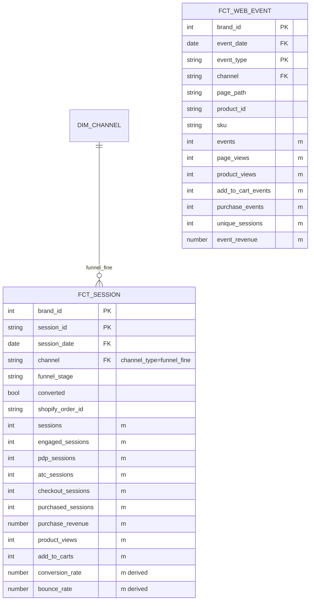
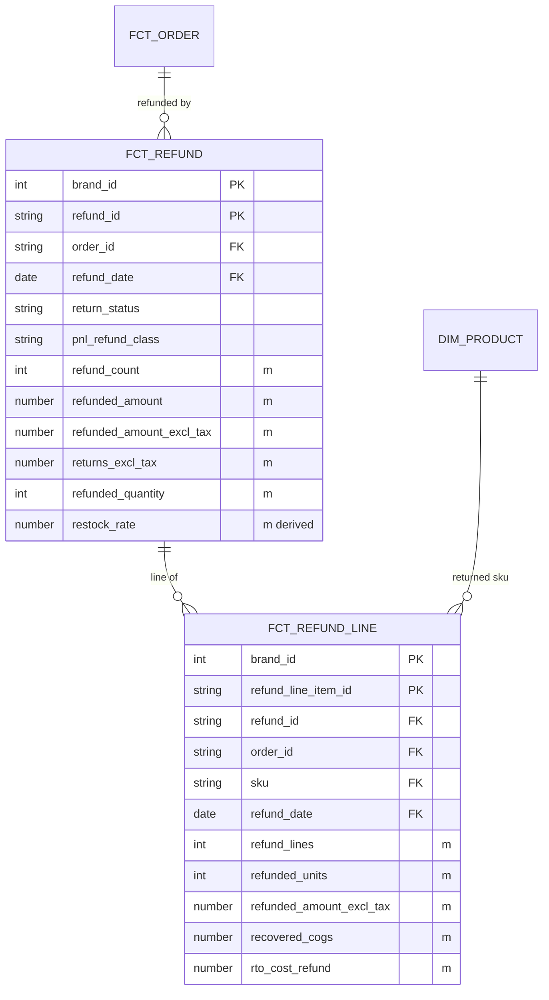
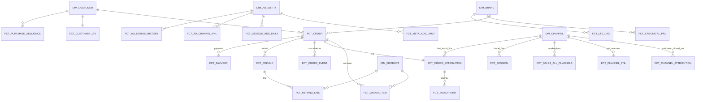

# Logical Data Model for Agentic Query Resolution — Analysis & Design

Status: **design proposal**, 2026-09-26. Author: analysis pass over the live
serve layer, catalogue, glossary and ontology.

Companion / prior art (read these; this doc does not restate them):
`catalogue/SERVE_LAYER_ARCHITECTURE.md` (gold→serve→Cube→catalogue governance),
`catalogue/CANONICAL_DATA_MODEL.md` (2026-07 fact/dim + bridge-view pass, already
implemented), `catalogue/openmetadata/ontology.yaml` (`grain_defaults`).

> This document is about the layer **between** a working physical model and the
> agent: the *logical concept layer* the agent resolves against. The physical
> serve layer is largely sound. Query resolution is not, and the reason is
> structural, not a collection of one-off bugs (P1-1 was one symptom).

---

## 0. TL;DR

The serve database, Cube views, and metric YAML are individually well-built and
governed. **Query resolution is unreliable because there is no logical layer that
maps a business *concept* to exactly one physical metric.** Instead the catalogue
exposes ~171 physical metrics as a *flat namespace* whose names collide on
business words:

- **"revenue" → 7 metrics across 5 views**; **"sales" → 7 across 4**;
  **"orders" → 6 across 5**; "profit", "total sales", "return revenue",
  "cancel revenue", "margin" each 3–4 across 2–3 views.
- These siblings are not wrong — they differ along **orthogonal axes** (revenue
  basis, business scope, attribution model, grain). But the catalogue encodes the
  axis *inside the metric id* (`net_sales_all_channels`, `attributed_net_revenue`,
  `commerce_net_revenue_daily`), so the only way to choose between them is
  fuzzy/substring matching over names — which is non-deterministic and
  phrasing-sensitive. That is exactly the P1-1 failure mode, and it is systemic.

**The fix is a Canonical Concept Layer**: ~25–30 business *concepts* (Revenue,
Orders, Profit, Spend, ROAS, …), each defined once, each carrying a small set of
**named, orthogonal axes** with declared defaults. Resolution becomes
`concept + axis selection → exactly one physical metric`, deterministically, with
the physical metrics kept underneath unchanged. This is additive and can ship
behind the existing search surface without a rebuild; a rebuild is possible but
not required and carries more risk than value.

---

## 1. Current state (measured)

### 1.1 Physical serve layer — sound

```
gold (ClickHouse, 78 tables)   facts + conformed dims, GST/basis resolved here
  → serve (41 ClickHouse VIEWs) one relation per data-product output port
  → Cube cubes (41) → Cube views (37 exposed)   the certified query surface
  → catalogue (metrics/dims/glossary/ontology)  what the agent navigates
```

- **37 serve views** exposed (`catalogue/views.yaml`), each denormalised to its
  grain, date-axis registered, freshness-gated. Governance is machine-checked
  (`scripts/reconcile_layers.py`, 0 unwaived blockers). **This layer is not the
  problem** and should not be rebuilt.
- Grains in play: order, order-item, daily rollup, event-date, channel-day,
  ad-grain (campaign/adset/ad), session, customer, refund-line, hour.

### 1.2 Metric catalogue — a flat namespace, 37% draft

| Cut | Count |
|---|---|
| Metric YAML files | 185 |
| In inventory matrix | 171 |
| **certified** | 106 |
| **draft** | **64 (37%)** |
| approved | 1 |
| Distinct cube views mapped | 24 |
| Dimensions (`core.yaml`) | 125 |
| Glossary term rows | 369 |

Metrics-per-view is lumpy (canonical_pnl 28, meta_ad_performance 28,
commerce_orders 16, product_performance 11, …), and 64 drafts means **more than
a third of the namespace resolves to something not certified** — e.g. the
canonical "channel revenue" answer (`channel_net_revenue`) is draft, so the
intended answer is unreachable while a wrong sibling wins (P1-1).

### 1.3 The concept×axis collision (the actual disease)

The same business concept is spread across views by axis. Measured families:

| Concept | # metrics | Views | The axes that distinguish them |
|---|---:|---|---|
| revenue | 7 | 5 | attribution(last-touch/channel/none) × scope(commerce/product) × basis(gross/net) × grain(order/daily) |
| sales | 7 | 4 | attribution(meta/google/none) × scope(all-channels/shopify) × basis(gross/net/total) |
| orders | 6 | 5 | attribution(last-touch/channel/platform/none) × scope(commerce/product) |
| total_sales | 4 | 3 | attribution × scope |
| profit | 4 | 2 | scope(company/all-channels/product) × basis(gross/net) |
| return_revenue | 3 | 3 | scope(P&L/event/product) |
| cancel_revenue | 3 | 3 | scope(P&L/event/product) |
| margin_pct | 3 | 2 | basis(gross/net) × scope(company/product) |
| ad_spend | 3 | 2 | platform(meta/google) × scope(product/shopify) |

Every one of these is a latent P1-1: an under-qualified question ("revenue by
channel", "sales by state", "profit") has **several equally-named candidates from
non-reconciling views**, and the resolver has no declared rule for which is
canonical. The axes are real and legitimate; the problem is they are **implicit,
name-encoded, and unenumerated**, so neither the resolver nor the agent can reason
about them.

### 1.4 The "channel" overload (worked example of an axis with no model)

"channel" resolves to **five different dimensions on five products**:

| Meaning | Dimension | View / product | Value space |
|---|---|---|---|
| Attribution closed set | `channel` | channel_attribution (ChannelAttribution) | meta/google/organic_shopify/unattributed |
| Last-touch fine | `lt_channel` | order_attribution (MarketingAttribution) | ig_feed/fb_feed/google_pmax/… |
| Marketplace commerce | `channel` | orders/sales_all_channels (CrossChannelCommerce) | shopify/… |
| Funnel/session fine | `channel` | funnel_daily/session_funnel | ig_feed/google_search/organic |
| P&L Overview | `channel` | channel_pnl | meta/google/organic/unattributed |
| Customer acquisition | `acquisition_channel` | customer_ltv | — |

The ontology's `grain_defaults.by_channel` already picks a default (ChannelAttribution
+ `channel_orders`) and lists the others as alternates — but that logic lives only
in prose the search path does not consult. **This is the shape of every axis
problem in the model.**

### 1.5 How resolution works today (and why it flips)

`catalogue_search_metrics` (`catalogue_service/service.py::search`) is a
deterministic **glossary-substring + token-overlap** matcher that returns matches
in insertion order — no relevance/grain scoring. Given the flat namespace + 369
glossary rows (many single-word: `revenue`, `profit`, `orders`), a broad term
substring-matches half the revenue family and file order decides #1. The recently
fixed grain-drop and specificity-ordering (this branch) stop the *worst* class
(grain-incapable metric at #1), but they are guardrails on a namespace that is
structurally ambiguous. **The durable fix is to remove the ambiguity from the
namespace, not to keep patching the matcher.**

---

## 2. Root cause

> The agent is asked to choose a **business concept at a business axis**
> ("net revenue, by attribution channel, this month"). The catalogue only offers
> **pre-flattened physical metrics** whose axis is baked into the name. So every
> query does a lossy, fuzzy inversion from concept-space back to metric-space, and
> when two metrics are near-neighbours in name but far apart in value (attribution
> ₹34.1L vs P&L ₹28.0L), the inversion is a coin flip.

Three compounding factors:

1. **No concept layer.** Nothing declares "Revenue is one concept with axes
   {basis, scope, attribution, grain}." Concepts exist only implicitly, as name
   prefixes/suffixes.
2. **Axes are not first-class.** `all_channels`, `attributed_`, `commerce_`,
   `_daily`, `meta_`/`google_` are naming conventions, not enumerated dimensions
   of a concept with defaults and legal combinations.
3. **Draft leakage.** 37% draft with no resolution rule for "canonical concept
   maps to a draft metric" → the intended answer is silently unreachable.

---

## 3. Proposed logical model — the Canonical Concept Layer

### 3.1 Shape

Add **one new declarative layer** above the existing physical metrics. Nothing
below changes. A concept file:

```yaml
# catalogue/concepts/revenue.yaml   (ILLUSTRATIVE)
id: revenue
display_name: Revenue
one_liner: Money from sales, net of GST unless stated.
# Orthogonal axes. Each axis has a closed value set and ONE default.
axes:
  basis:        { values: [net, gross, total], default: net }        # ex-GST / incl-discount / incl-GST
  scope:        { values: [company, shopify, product], default: company }
  attribution:  { values: [none, last_touch, channel], default: none }
  grain:        { values: [period, order, daily], default: period }
# The resolution table: every LEGAL axis combination → exactly one physical metric.
# Illegal/absent combinations resolve to an explicit "unsupported" with the reason.
resolves:
  - when: { basis: net, scope: company, attribution: none }
    metric: net_sales_all_channels
  - when: { basis: net, scope: shopify, attribution: none }
    metric: commerce_net_revenue_daily
  - when: { basis: net, scope: company, attribution: last_touch }
    metric: attributed_net_revenue          # by lt_channel/lt_campaign
  - when: { basis: net, scope: company, attribution: channel }
    metric: channel_net_revenue
    status: draft                            # surfaced honestly; see fallback
    fallback_metric: channel_orders
    fallback_note: channel_net_revenue is uncertified; report orders or
      meta/google_attribution_net_sales for dashboard parity.
  - when: { basis: gross, scope: company, attribution: none }
    metric: gross_sales_all_channels
  # …one row per legal combination; missing combos are explicitly unsupported.
disambiguation: >
  Attribution-channel and P&L are different readings and will not reconcile
  (~20% apart). If the user did not name an axis, use the defaults and state
  them in one line.
```

Key properties:

- **Deterministic.** `(concept, axes)` is a lookup, not a fuzzy match. Same input
  → same metric, always. Phrasing cannot flip it.
- **Axes are explicit and enumerable.** The agent (and a UI) can ask "net or
  gross? attribution or P&L?" instead of guessing. When axes are unspecified,
  declared **defaults** apply and are disclosed — matching the MCP response
  contract ("apply reasonable defaults and state them briefly").
- **Draft is a first-class state**, not a silent hole: a concept can resolve to a
  draft metric *with* a declared fallback and note, so the agent degrades
  gracefully instead of surfacing the wrong sibling.
- **Reuses the physical metrics unchanged.** This is a routing table over what
  already exists; `_check_integrity` still validates every `metric:` target.

### 3.2 The concept inventory (~25–30, from §1.3 families + singletons)

Commerce/finance: **Revenue, Sales, Orders, Profit, Margin, COGS, Discounts,
Refunds/Returns, Cancellations, Taxes, AOV, Contribution.**
Marketing: **Ad Spend, ROAS, MER, CAC, Attributed Revenue/Orders, Impressions,
Clicks, CTR, CPC, CPM, Reach/Frequency.**
Customer: **LTV, New/Repeat Customers, Repeat Rate.**
Web: **Sessions, Conversion Rate, Product/Collection Views, Add-to-Carts.**

Each collapses a name-collision family (§1.3) into one concept + axes. The ~171
physical metrics become the *leaves* of ~28 concepts.

### 3.3 Axis vocabulary (the small closed set that spans the model)

| Axis | Values | Notes |
|---|---|---|
| `basis` | net / gross / total | ex-GST / incl-discount / incl-GST — the single largest wrong-answer source; must be explicit |
| `scope` | company(all-channels) / shopify / product | "all channels" is the operator default for topline |
| `attribution` | none / last_touch / channel / platform | none=commerce P&L; the axis that separates ₹34.1L from ₹28.0L |
| `platform` | meta / google / all | for ad-delivery concepts |
| `grain` | period / order / daily / event / ad / session / customer / hour | period=default topline; finer grains for breakdowns |
| `time_basis` | order_date / event_date / report_date | reconciliation axis (event-date returns vs period rollup) |

These map 1:1 onto existing dimensions and naming conventions — the layer just
**names and enumerates** what is currently implicit.

### 3.4 How resolution changes

```
Today:   "net revenue by channel"
         → search() fuzzy over 171 names → ranked list → agent takes #1 (flips)

Proposed: "net revenue by channel"
         → concept=revenue (glossary term → concept, not metric)
         → axes parsed: basis=net (stated), attribution=channel ("by channel"),
           scope=company (default), grain=daily (breakdown)
         → resolves[] lookup → channel_net_revenue (draft) → fallback rule
         → deterministic answer + one-line disclosure of defaults used
```

The glossary's job shrinks and sharpens: **term → (concept, axis hints)**, not
term → metric. 369 fuzzy rows collapse toward ~28 concept anchors + axis keywords
(`net`, `gross`, `all channels`, `shopify`, `attributed`, `by channel`, …).

---

## 4. What to keep, collapse, and decide

**Keep as-is (do not rebuild):**
- The entire physical serve layer (gold→serve→Cube views) and its governance.
- The metric YAML files as the *leaves* / physical bindings.
- The query executor (`app/query_planner.py`, provenance, time-range composition,
  fan-out guards) — the concept layer feeds it the same resolved metric id.

**Collapse / add:**
- Add `catalogue/concepts/*.yaml` (the new layer) + a loader + resolver.
- Reframe `glossary/terms.yaml` as term→concept+axis (migrate incrementally).
- Fold `ontology.yaml grain_defaults` into the concept axis defaults (it is
  already the same idea for the channel axis — generalise it).
- Triage the 64 drafts: certify, delete, or bind as an explicit
  draft-with-fallback in a concept (no more silent holes).

**Open decisions (yours to make):**
1. **Concept layer additive vs rebuild.** Recommended: **additive** (strangler-fig
   over the existing search surface). A ground-up rebuild of the catalogue is
   possible but the physical layer is sound and the risk/value is poor — the
   ambiguity is in the *logical* layer, so fix it there.
2. **Resolution when axes are unspecified:** auto-apply declared defaults + disclose
   (recommended, matches MCP contract) vs. ask the user. Recommend auto+disclose,
   ask only when the axis materially changes the number *and* is genuinely
   ambiguous (attribution-vs-P&L is the canonical "ask or clearly disclose" case).
3. **Draft policy:** does "revenue by channel" answer from `channel_orders`
   fallback, or refuse until `channel_net_revenue` certifies? (Data-certification
   call — I cannot validate the metric's correctness.)

---

## 5. Migration path (additive, each step revertable)

1. **Author the concept schema + loader** (`concepts/*.yaml`, pydantic model,
   `_check_integrity` extended so every `resolves[].metric` must exist and be
   queryable, drafts flagged). No behaviour change yet.
2. **Populate the 9 collision families first** (§1.3) — highest resolution-error
   payoff. Each concept's `resolves[]` table is filled from the existing metric
   YAML `cube_mapping` + `supported_dimensions` (mechanical).
3. **Route `resolve_term`/`search` through concepts** when a concept matches; fall
   back to today's matcher otherwise. Ship behind this dual path so nothing
   regresses.
4. **Migrate glossary rows** to term→concept+axis for the covered concepts; retire
   the now-redundant single-word metric rows.
5. **Complete the concept inventory** (§3.2), triage drafts, then make the concept
   path primary and the legacy matcher the fallback.
6. **Tests** (per the repo's testing bar): a resolution golden-set — for each
   concept, assert every legal axis combo maps to the expected metric and every
   illegal combo returns unsupported-with-reason. This is the regression harness
   that makes P1-1-class flips impossible to reintroduce (extends the two
   grain/ontology tests already added this branch).

---

## 6. Why this is the right altitude

- It attacks the **root** (concept↔metric ambiguity), not symptoms (matcher
  ranking). The matcher patches on this branch are guardrails; this removes what
  they guard against.
- It is **deterministic and inspectable** — a resolution table a human can read
  and a test can pin, which the MCP's "never fabricate, evidence-bound" rules
  require.
- It **reuses** the sound physical layer and the executor; the change is one new
  declarative layer + a loader + a resolver, not a rebuild.
- It makes **axes and drafts explicit**, so "clean and understandable" is a
  property of the model, not a hope: any operator can read `revenue.yaml` and see
  exactly what "revenue" can mean and which number they get.

---

## 7. Logical data model — ERD

The physical serve layer is 37 denormalised views (§1.1). This section reorganises
them into a **clean logical star schema**: a small set of **conformed dimensions**
shared across the model, and **fact tables** at one grain each, referencing those
dimensions. This is the model the Concept Layer (§3) resolves onto — every
`resolves[].metric` is a measure on one of these facts.

### 7.1 Modeling rules

1. **One fact per business grain.** Order, order-item, attribution, ad-day,
   channel-day, session, refund, refund-line, customer, P&L-day, payment.
2. **Conformed dimensions are defined once** and reused by FK from every fact
   (`brand_id`, `date`, customer, product, ad-entity, channel, payment, geography).
3. **Channel is modeled explicitly as a typed dimension** (§1.4) — the single
   biggest source of wrong joins. `channel_type` names *which* channel axis.
4. **Dead columns are excluded** (§7.5): a dimension that is 0%-populated is not in
   the logical model even though it exists physically.
5. **Basis is in the column name** (`*_excl_tax`, `gross_*`, `net_*`) — never
   inferred.

Legend: **PK** primary-key part · **FK** foreign key · *(m)* additive measure.

### 7.2 Conformed dimensions



`DIM_CHANNEL.channel_type` closed set (resolves the §1.4 overload):
`attribution_closed_set` (meta/google/organic_shopify/unattributed) ·
`last_touch_fine` (ig_feed/fb_feed/google_pmax/…) · `marketplace` (shopify/…) ·
`funnel_fine` (ig_feed/google_search/organic/…) · `pnl_overview`
(meta/google/organic/unattributed). A query must resolve `channel_type` before a
`channel_value` filter is legal.

### 7.3 Fact tables by domain

#### Commerce (physical: `commerce_orders`, `commerce_performance`, `orders/sales/returns_cancels_all_channels`)



- `FCT_ORDER` = daily/order-grain Shopify commerce (the "Total Sales / AOV / orders"
  facts). `orders_all_channels` / `sales_all_channels` / `returns_cancels_all_channels`
  are the **marketplace-channel rollups** (`report_date × channel`) — modeled as
  `FCT_SALES_ALL_CHANNELS` etc., FK to `DIM_CHANNEL(channel_type=marketplace)`.

#### Product (physical: `product_performance`)



#### Attribution (physical: `order_attribution`, `touchpoints`, `attribution_paths`, `meta_ad_attribution`, `channel_attribution`, `platform_attribution_commerce`)



- `meta_ad_attribution` (ad-day last-touch) and `platform_attribution_commerce`
  (order×platform) are additional attribution facts keyed to `DIM_AD_ENTITY` /
  platform — same pattern, omitted from the diagram for brevity.

#### Paid media (physical: `meta_ad_performance(_hourly/_breakdown)`, `google_ad_performance(_hourly)`, `ad_channel_pnl`, `*_status_history`)



- Meta hourly / breakdown are **grain variants** of `FCT_META_ADS_DAILY` (add
  `hour_of_day` / `breakdown_type`), not separate concepts. `breakdown_type` is a
  `fanout_dimension` — must be filtered to one value before summing.

#### Finance / P&L (physical: `canonical_pnl`, `channel_pnl`, `finance_waterfall`, `payments`, `ltv_cac`)



`FCT_CANONICAL_PNL` is the P&L spine. Identities hold to the paisa (per
`SERVE_LAYER_ARCHITECTURE §9.1`): `net_cogs = product_cost + operating_cost`;
`gross_profit = net_sales − net_cogs`; `net_profit = contribution_margin −
total_ad_spend`; `total_operating_cost` is an alias of `net_cogs`.

#### Customer (physical: `customer_ltv`, `customer_data`, `purchase_sequence`)



#### Web / funnel (physical: `session_funnel`, `funnel_daily`, `web_events`, `web_events_daily`)



- `funnel_daily` and `web_events_daily` are the **daily rollups** (`report_date ×
  channel`) of `FCT_SESSION` / `FCT_WEB_EVENT` — same measures, coarser grain.

#### Operations / returns (physical: `refund_events`, `return_lifecycle`)



### 7.4 Master relationship map



`FCT_CANONICAL_PNL`, `FCT_LTV_CAC`, `FCT_FINANCE_WATERFALL` are brand×date rollups
that reconcile *from* the order/attribution/ad facts but are stored pre-aggregated
(the P&L spine) — they attach to `DIM_BRAND`/`DIM_DATE` only.

### 7.5 Columns deliberately excluded (dead / unusable)

Per `SERVE_LAYER_ARCHITECTURE §9.2`, these exist physically but carry no signal, so
they are **omitted from the logical model** (grouping/filtering by them returns one
mislabelled bucket):

| Physical column(s) | View | State |
|---|---|---|
| `utm_source`, `utm_medium`, `utm_campaign` | `commerce_orders` | 0 / 22,798 orders populated |
| `device_type`, `browser_family`, `os_family` | `session_funnel` | 0 / 367,503 sessions |
| `country`, `impression_device` | `meta_ad_breakdown_performance` | 0 / 293,786 rows (use `breakdown_type`) |
| `accepts_marketing` | `customer_data` | constant 0 for all 29,105 customers |
| `creative_*` (name/cta/thumbnail/…) | Meta ads, last 30d | dropped ~89%→~5% Aug 2026 (upstream loader regression) |

`creative_*` stays in `DIM_AD_ENTITY` for historical queries but must be
null-flagged for recent windows.

### 7.6 Concept Layer → physical binding

Each Concept (§3) resolves to a measure on one fact above. The collision families
(§1.3) collapse cleanly:

| Concept | Axis selection | Physical fact.measure |
|---|---|---|
| Revenue | basis=net, scope=company | `FCT_CANONICAL_PNL.net_sales_all_channels_pnl` |
| Revenue | basis=net, scope=shopify | `FCT_ORDER.net_revenue_excl_tax` (or daily rollup) |
| Revenue | attribution=last_touch | `FCT_ORDER_ATTRIBUTION.attributed_net_revenue` |
| Revenue | attribution=channel | `FCT_CHANNEL_ATTRIBUTION.net_revenue_excl_tax` *(draft → fallback)* |
| Orders | attribution=none, scope=company | `FCT_ORDER.orders` |
| Orders | attribution=channel | `FCT_CHANNEL_ATTRIBUTION.orders` |
| Profit | basis=net, scope=company | `FCT_CANONICAL_PNL.net_profit_all_channels` |
| Profit | scope=product | `FCT_ORDER_ITEM.gross_profit_ex_gst` |
| Ad Spend | platform=meta | `FCT_META_ADS_DAILY.meta_spend` |
| Ad Spend | platform=all | `FCT_CANONICAL_PNL.total_ad_spend` |
| ROAS | basis=net, scope=company | `FCT_CANONICAL_PNL.net_roas_all_channels` |

The full binding is the `resolves[]` table in each `concepts/*.yaml`; this table is
the illustrative head.

---

## 8. The proposed Concept Layer (built)

This is the built-out version of the §3 sketch: the actual conceptual models the
agent resolves against. Every `→ metric` below is a real catalogue metric id bound
to a §7 fact.measure. Concepts live in `catalogue/concepts/*.yaml`; the resolver
turns `(concept, axis selection)` into exactly one metric id (or an explicit
unsupported/ambiguous response).

### 8.1 Canonical axis dictionary (shared across all concepts)

One closed vocabulary, reused everywhere — this is what makes resolution
composable instead of per-metric.

| Axis | Values (default **bold**) | Meaning |
|---|---|---|
| `basis` | **net** · gross · total | net = ex-GST after discounts/returns (dashboard) · gross = ex-GST pre-discount · total = incl-GST |
| `scope` | **company** · shopify · product · all_channels | company = all-channels P&L spine · shopify = Shopify-only commerce · product = SKU/line grain · all_channels = marketplace rollup |
| `attribution` | **none** · last_touch · channel · platform | none = commerce (no attribution) · last_touch = order_attribution (lt_*) · channel = ChannelAttribution closed set · platform = meta/google attribution facts |
| `platform` | **all** · meta · google | for ad-delivery & platform-attribution concepts |
| `grain` | **period** · order · daily · event · ad · campaign · adset · session · customer · hour | period = topline total; finer grains for breakdowns |
| `time_basis` | **order_date** · event_date · report_date | reconciliation axis (event-date returns vs period rollup) |

Rule: unspecified axes take the **default** and the resolver **discloses which
defaults it applied** in one line (per the MCP response contract). An axis is only
*asked* when it materially changes the number **and** is genuinely ambiguous —
`attribution` for revenue/orders is the one axis that usually warrants an ask or an
explicit "attributed vs P&L" disclosure.

### 8.2 Concept registry (28 concepts)

| Concept | Axes that apply | Default resolution (all-default axes) |
|---|---|---|
| **Sales / Revenue** | basis, scope, attribution, grain | `net_sales_all_channels` |
| **Orders** | attribution, scope, status, grain | `total_orders` |
| **Profit** | basis, scope | `net_profit_all_channels` |
| **Margin %** | basis, scope | `net_margin_pct` |
| **COGS / Operating Cost** | scope, component | `total_operating_cost_all_channels` |
| **Discounts** | scope | `discounts` |
| **Returns / Cancels** | measure(revenue/orders/units), action(return/cancel/both), scope | `returns_cancels_all_channels` |
| **Taxes** | — | `taxes_on_net_sales` |
| **Contribution** | — | `contribution_margin` |
| **AOV** | attribution | `aov` |
| **ASP** | — | `average_selling_price` |
| **Units Sold** | basis | `units_sold` |
| **Ad Spend** | platform, grain | `total_ad_spend` |
| **ROAS** | basis(net/gross/breakeven), scope, platform | `net_roas_all_channels` |
| **MER** | scope | `mer` |
| **CAC** | — | `cac` |
| **LTV** | horizon(first_order/lifetime) | `ltv` |
| **LTV:CAC** | — | `ltv_cac_ratio` |
| **Ad Net Profit** | platform, grain | `ad_channel_net_profit` |
| **Attributed Revenue** | attribution, grain | `attributed_net_revenue` |
| **Attributed Orders** | attribution, grain | `attributed_orders` |
| **New / Repeat Customers** | type(new/repeat/all) | `new_customers` |
| **Repeat Rate** | measure(customer/order) | `repeat_rate` |
| **Impressions/Clicks/CTR/CPC/CPM** | platform, grain | `meta_impressions` … (per metric) |
| **Reach / Frequency** | platform | `meta_reach` / `meta_frequency` |
| **Sessions** | grain | `web_sessions` |
| **Conversion Rate** | source(session/funnel) | `session_conversion_rate` |
| **Web Engagement** | event(pdp/atc/collection/search/pageview) | `product_views` … (per event) |
| **Attribution Quality** | measure(rate/confidence/touches) | `attribution_rate` |

### 8.3 Flagship concept definitions (the collision families, full form)

```yaml
# catalogue/concepts/sales.yaml   — collapses the "revenue"(7) + "sales"(7) families
id: sales
display_name: Sales / Revenue
one_liner: Money from sales; net (ex-GST, after discounts & returns) unless stated.
aliases: [revenue, sales, net sales, topline, turnover]
axes:
  basis:       { values: [net, gross, total], default: net }
  scope:       { values: [company, shopify, product], default: company }
  attribution: { values: [none, last_touch, channel, platform], default: none }
  grain:       { values: [period, order, daily], default: period }
resolves:
  - when: { basis: net,   scope: company, attribution: none }   → net_sales_all_channels
  - when: { basis: gross, scope: company, attribution: none }   → gross_sales_all_channels
  - when: { basis: total, scope: company, attribution: none }   → total_sales_all_channels
  - when: { basis: net,   scope: shopify, attribution: none, grain: period } → commerce_net_revenue_daily
  - when: { basis: net,   scope: shopify, attribution: none, grain: order }  → commerce_net_revenue
  - when: { basis: gross, scope: shopify, attribution: none }   → gross_sales
  - when: { basis: total, scope: shopify, attribution: none }   → total_sales
  - when: { basis: net,   scope: product }                       → product_net_revenue
  - when: { basis: net,   attribution: last_touch }              → attributed_net_revenue
  - when: { basis: gross, attribution: last_touch }              → attributed_gross_revenue
  - when: { basis: net,   attribution: channel }                 → channel_net_revenue      # draft
    status: draft
    fallback: { metric: channel_orders, note: "channel_net_revenue uncertified; report orders, or meta/google_attribution_net_sales for dashboard parity" }
  - when: { basis: net,   attribution: platform, platform: meta }   → meta_attribution_net_sales
  - when: { basis: net,   attribution: platform, platform: google } → google_attribution_net_sales
disambiguation: >
  attribution=none (P&L) and attribution=last_touch/channel do NOT reconcile
  (~20% apart). If attribution is unstated, default to none and say so.
unsupported:
  - { basis: total, scope: product, reason: "product grain has no incl-GST measure" }
```

```yaml
# catalogue/concepts/orders.yaml   — collapses the "orders"(6) family + status counts
id: orders
display_name: Orders
one_liner: Count of orders; all-channels total unless a scope/status is named.
aliases: [orders, order count, order volume]
axes:
  attribution: { values: [none, last_touch, channel, platform], default: none }
  scope:       { values: [company, shopify, product], default: company }
  status:      { values: [all, cod, prepaid, new, cancelled, returned, first, repeat, active], default: all }
  grain:       { values: [period, order, daily], default: period }
resolves:
  - when: { attribution: none, scope: company, status: all }   → total_orders
  - when: { attribution: none, scope: shopify, status: all }   → orders
  - when: { attribution: none, scope: product }                 → product_orders
  - when: { attribution: last_touch }                           → attributed_orders       # slice by lt_platform for meta/google
  - when: { attribution: channel }                              → channel_orders          # draft
  - when: { attribution: platform }                             → ad_channel_orders       # cross-platform ad-grain, slice by channel (meta/google)
  - when: { status: cod }        → cod_orders
  - when: { status: prepaid }    → prepaid_orders
  - when: { status: new }        → new_customer_orders
  - when: { status: cancelled }  → cancelled_orders
  - when: { status: returned }   → refunded_orders
  - when: { status: first }      → first_orders
  - when: { status: repeat }     → repeat_orders
  - when: { status: active }     → active_orders
```

```yaml
# catalogue/concepts/profit.yaml   — collapses "profit"(4)
id: profit
display_name: Profit
one_liner: Bottom-line profit; all-channels net unless stated.
aliases: [profit, net profit, bottom line]
axes:
  basis: { values: [gross, net, contribution], default: net }
  scope: { values: [company, all_channels, shopify, blended, product], default: all_channels }
resolves:
  - when: { basis: net,          scope: all_channels } → net_profit_all_channels
  - when: { basis: net,          scope: shopify }      → net_profit
  - when: { basis: net,          scope: blended }      → net_profit_blended
  - when: { basis: gross,        scope: company }      → gross_profit
  - when: { basis: contribution, scope: company }      → contribution_margin
  - when: { basis: gross,        scope: product }      → product_gross_profit    # draft
```

```yaml
# catalogue/concepts/ad_spend.yaml   — collapses "ad_spend"(3) + platform spends
id: ad_spend
display_name: Ad Spend
one_liner: Advertising spend; all platforms (Meta+Google) unless one is named.
aliases: [ad spend, spend, marketing spend, performance marketing]
axes:
  platform: { values: [all, meta, google, shopify_card], default: all }
  grain:    { values: [period, campaign, adset, ad, hour], default: period }
resolves:
  - when: { platform: all,          grain: period }   → total_ad_spend
  - when: { platform: shopify_card, grain: period }   → shopify_ad_spend
  - when: { platform: meta,         grain: period }   → meta_spend
  - when: { platform: google,       grain: period }   → google_spend
  - when: { grain: campaign }                          → ad_channel_spend   # cross-platform, slice by channel
  - when: { grain: adset }                             → ad_channel_spend   # Meta-deep
  - when: { grain: ad }                                → ad_channel_spend
```

```yaml
# catalogue/concepts/roas.yaml   — collapses the ROAS family
id: roas
display_name: ROAS
one_liner: Return on ad spend; all-channels net unless stated.
aliases: [roas, return on ad spend]
axes:
  basis:    { values: [net, gross, breakeven], default: net }
  scope:    { values: [company, shopify], default: company }
  platform: { values: [all, cross], default: all }
resolves:
  - when: { basis: net,       scope: company } → net_roas_all_channels
  - when: { basis: net,       scope: shopify } → net_roas
  - when: { basis: gross,     scope: company } → gross_roas_all_channels
  - when: { basis: gross,     scope: shopify } → gross_roas
  - when: { basis: breakeven, scope: company } → be_roas_all_channels
  - when: { basis: breakeven, scope: shopify } → be_roas
  - when: { platform: cross }                   → ad_channel_roas   # by channel/campaign
```

### 8.4 Resolution bindings for the remaining concepts

Compact form of each `resolves[]` (axis selection → metric id):

- **Margin %** — gross/company→`gross_margin_pct` · net/company→`net_margin_pct` ·
  contribution/company→`contribution_margin_pct` · gross/product→`product_gross_margin_pct`*draft*
- **COGS / Operating Cost** — net/all_channels→`total_operating_cost_all_channels` ·
  net/shopify→`total_operating_cost` (=`net_cogs`) · product→`product_cogs` (goods only `product_cost`) ·
  component: shipping→`shipping_cost` · packaging→`packaging_cost` · gateway→`payment_gateway_fees` ·
  rto→`rto_cost` · product/all_channels→`product_cost_all_channels`
- **Discounts** — →`discounts`
- **Returns / Cancels** — return+revenue: pnl→`return_revenue` · event→`event_return_revenue` ·
  product→`product_return_revenue`. cancel+revenue: pnl→`cancel_revenue` · event→`event_cancel_revenue` ·
  product→`product_cancel_revenue`. both+revenue: all_channels→`return_cancel_revenue_all_channels` ·
  shopify→`return_cancel_revenue`. both+orders: all_channels→`returns_cancels_all_channels` ·
  shopify→`returns_cancels`. returned+orders→`refunded_orders` · cancelled+orders→`cancelled_orders` ·
  returned+units→`returned_units` · refund count→`refund_count` · refund lines→`refund_lines`
- **Taxes** — →`taxes_on_net_sales`
- **Contribution** — →`contribution_margin`
- **AOV** — none→`aov` · last_touch→`attributed_aov`
- **ASP** — →`average_selling_price`
- **Units Sold** — net→`units_sold` · gross→`gross_units_ordered` · per-order→`units_per_order`
- **MER** — →`mer`  (all-channels variant is a canonical_pnl measure, not a separate catalogue metric)
- **CAC** — →`cac`
- **LTV** — first_order→`ltv` (new-customer first-order AOV) · lifetime→`avg_ltv` (customer lifetime)
- **LTV:CAC** — →`ltv_cac_ratio`
- **Ad Net Profit** — cross/campaign→`ad_channel_net_profit` · meta→`meta_net_profit` · google→`google_net_profit`
- **Attributed Revenue** — last_touch→`attributed_net_revenue` · gross→`attributed_gross_revenue` ·
  refund→`attributed_refund_amount` · platform: meta→`meta_attribution_net_sales` · google→`google_attribution_net_sales`
- **Attributed Orders** — last_touch→`attributed_orders` (slice by lt_platform) · touch→`touch_attributed_orders` ·
  by-channel ad-grain→`ad_channel_orders` · new→`attributed_new_customer_orders`
- **New / Repeat Customers** — new→`new_customers` · repeat→`repeat_customers` · all→`customers` ·
  avg orders/cust→`avg_orders_per_customer`
- **Repeat Rate** — customer→`repeat_rate` · order→`repeat_order_share`
- **Impressions** — meta→`meta_impressions` (hourly `meta_impressions_hourly`, breakdown `meta_breakdown_impressions`) · google→`google_impressions`
- **Clicks** — meta→`meta_clicks`/`meta_link_clicks` · google→`google_clicks`
- **CTR / CPC / CPM** — meta→`meta_ctr`/`meta_cpc`/`meta_cpm` · google→`google_ctr`/`google_cpc`/`google_cpm`
- **Reach / Frequency** — →`meta_reach` / `meta_frequency`
- **Sessions** — →`web_sessions`
- **Conversion Rate** — session→`session_conversion_rate` · funnel→`funnel_conversion_rate`
- **Web Engagement** — pdp→`product_views` · collection→`collection_views` · atc→`add_to_cart_events` ·
  pageview→`web_page_views` · search→`site_search_events` · events/session→`events_per_session`
- **Attribution Quality** — rate→`attribution_rate` · confidence→`avg_attribution_confidence` · touches→`avg_touch_count`

### 8.5 Resolver algorithm

```
resolve(query):
  concept  = match query → concept.id           # via aliases + glossary (term → concept)
  axes     = parse query for axis keywords       # "net"/"gross", "shopify", "by channel",
                                                  # "meta", "last-touch", "per campaign", …
  axes     = fill_defaults(concept, axes)         # unspecified → declared default
  row      = concept.resolves.match(axes)         # exact axis-tuple lookup
  if row is None:            return UNSUPPORTED(concept, axes, nearest_supported)
  if row.status == draft:    return RESOLVED(row.fallback.metric, note=row.fallback.note)
  return RESOLVED(row.metric, defaults_applied=axes_defaulted, disambiguation=concept.disambiguation)
```

Properties: deterministic (tuple lookup, no fuzzy rank) · defaults disclosed ·
draft handled explicitly · unsupported returns the reason + nearest legal axis set,
never a wrong sibling. `_check_integrity` validates at load that every `→ metric`
exists and is queryable (drafts flagged), so a broken binding fails the whole
catalogue rather than misresolving at runtime.

### 8.6 Draft-binding policy

64 metrics are draft (§1.2). In a concept they must be bound as
`status: draft` **with a `fallback`** (as in `sales.yaml` above), so the concept
always yields a usable answer + an honest caveat. Certifying vs deleting each draft
is a separate data-quality decision — the concept layer just stops a draft from
silently winning or silently vanishing.

---

## 9. Channel extensibility — new channels & sub-channels without a model change

Today channels are Meta / Google (+ organic / unattributed). Tomorrow: WhatsApp,
Amazon, quick-commerce, and sub-channels (placements, ad formats). The model must
absorb these **without** adding a metric, a column, or a glossary row per channel.

### 9.1 The rule: channel is a *dimension value*, never a *metric-name axis*

There are two ways channel shows up in the current model:

| Pattern | Example | Adding WhatsApp costs |
|---|---|---|
| **Long / tall** (channel is a dimension) | `ad_channel_pnl.spend` grouped by `channel` · `channel_attribution.net_revenue` by `channel` | **one data row** (`channel='whatsapp'`). Zero schema/catalogue/glossary change. |
| **Wide** (channel baked into name) | `canonical_pnl.meta_spend` / `google_spend` · `channel_pnl.meta_net_sales` / `google_net_sales` · catalogue metrics `meta_spend`, `google_spend`, `meta_attribution_net_sales` | a new column **+** a new catalogue metric **+** glossary rows **+** a concept binding — everywhere, forever. |

> **Design rule:** every "by channel / by platform" answer resolves to a
> **channel-keyed long fact** (`ad_channel_pnl`, `channel_attribution`,
> `sales_all_channels`), never to a wide per-channel column or metric. Wide
> per-channel columns are allowed **only** on the fixed P&L spine
> (`canonical_pnl`) as a presentation convenience, and even there they should be
> *derived from* the long fact, not authored independently.

### 9.2 Taxonomy closed, membership open

- **`channel_type` stays a closed set** (the 5 meanings in §7.2:
  attribution_closed_set / last_touch_fine / marketplace / funnel_fine /
  pnl_overview). New *types* are rare and a deliberate catalogue change.
- **Channel *values* are open and data-driven.** The list of channels is
  `SELECT DISTINCT channel` on the fact, resolved at query time — not enumerated
  in the catalogue. A new channel appears in group-bys automatically.
- **A catch-all is mandatory.** Every fact keeps `unattributed` / `other` so a
  channel the loader hasn't mapped yet never *drops* revenue — it lands in the
  bucket and is visible, not lost.

### 9.3 One normalization map, not N metrics

The only place a new channel is "declared" is a **channel normalization map** —
raw source (`source_platform`, `utm_source/medium`, ad-account) → canonical
`channel` + `channel_type` + `parent_channel`:

```yaml
# catalogue/dimensions/channel_map.yaml   (ILLUSTRATIVE)
channels:
  - canonical: meta      channel_type: attribution_closed_set  parent: null
    matches: [facebook, fb, instagram, ig, "fb_feed", "ig_feed", "meta"]
  - canonical: google    channel_type: attribution_closed_set  parent: null
    matches: [google, "google_pmax", "google_search", adwords]
  - canonical: whatsapp  channel_type: attribution_closed_set  parent: null   # ← the only edit to add WhatsApp
    matches: [whatsapp, wa, "wa_business"]
  - canonical: unattributed  channel_type: attribution_closed_set  parent: null
    matches: ["*"]        # catch-all
```

Adding WhatsApp = **one entry here** + the loader emitting those rows. Every
channel-keyed metric, the `by_channel` grain default, and the concept layer
inherit it with no further edit.

### 9.4 Sub-channels = a hierarchy on the same dimension

Sub-channels are **levels of one channel hierarchy**, not new dimensions:

```
platform  (meta)               ← coarse, closed_set / pnl_overview
  → channel (ig_feed, fb_feed) ← fine, last_touch_fine / funnel_fine  (existing lt_channel)
    → placement (reels, stories, feed)   ← sub-channel, new level
      → ad                       ← ad grain
```

"by channel" resolves to whichever **level** the question implies (default: the
coarse platform level); the agent can drill down a level without a new metric —
same measure, finer `dimension_level`. This reuses the existing `channel`
(coarse) vs `lt_channel` (fine) split; a placement level is just a third rung.

### 9.5 What changes in the Concept Layer (§8)

The `platform` axis becomes a **filter on the channel dimension, not a pick of a
different metric.** Concretely, `ad_spend` gains a channel dimension instead of
per-platform rows:

```yaml
# REVISED catalogue/concepts/ad_spend.yaml  (extensible form)
id: ad_spend
axes:
  channel: { dimension: channel, default: all }     # values are DATA: meta/google/whatsapp/…
  grain:   { values: [period, campaign, adset, ad], default: period }
resolves:
  - when: { grain: period }   → total_ad_spend        # all-channel total (sums every channel)
  - when: { grain: campaign } → ad_channel_spend       # channel-keyed; filter/group by channel
  # NO per-channel rows. "meta spend" = ad_channel_spend WHERE channel=meta.
compat_aliases:                                        # keep old ids working, resolve to filter
  meta_spend:   { metric: ad_channel_spend, filter: { channel: meta } }
  google_spend: { metric: ad_channel_spend, filter: { channel: google } }
```

So `meta_spend` / `google_spend` (and `meta_attribution_net_sales` etc.) survive
as **compat aliases that expand to `(channel-keyed metric, channel=X)`** — no
`whatsapp_spend` metric is ever created; "whatsapp spend" resolves the same way
against the same metric with `channel=whatsapp`.

### 9.6 How the agent resolves a channel it has never seen

1. Concept + axes resolve the **measure** (`ad_spend` → `ad_channel_spend`) — pure
   catalogue, deterministic.
2. The channel **value** ("whatsapp") is resolved against **live dimension values**
   (`catalogue_resolve_dimension` / `SELECT DISTINCT channel`), not the catalogue —
   fuzzy-matched to a canonical channel via the §9.3 map.
3. If the value exists in data → filter and answer. If it doesn't exist yet →
   "no WhatsApp data in this period" (honest empty), **not** an error and **not** a
   wrong sibling.
4. A bare "by channel" with no value named → group by the channel dimension and
   return **every** channel present, including ones added after this doc was
   written. The agent never needs the channel list enumerated anywhere.

### 9.7 Adding a new channel — the whole checklist

1. Loader emits rows with the new `channel` value into the channel-keyed facts
   (`ad_channel_pnl`, `channel_attribution`, `sales_all_channels`).
2. Add one entry to `channel_map.yaml` (§9.3).
3. *(Optional)* if the fixed P&L card must show it as its own line, add a derived
   column on `canonical_pnl` sourced from the long fact — otherwise `total_ad_spend`
   already includes it.

No new metric, no glossary edit, no concept edit, no agent change. That is the test
of whether the model is "clean": **a new channel is a data event, not a code
change.**

### 9.8 Migration implication

The wide per-channel catalogue metrics (`meta_spend`, `google_spend`,
`meta_net_profit`, `google_net_profit`, `meta_attribution_net_sales`,
`google_attribution_net_sales`, and the `channel_pnl.meta_*/google_*/organic_*`
columns) should be **demoted to compat aliases** (§9.5) over the channel-keyed
facts, then frozen. Keep them resolving for back-compat; stop adding to them. New
channel work only ever touches the long facts + the channel map.

---

### Appendix A — evidence index (files read for this analysis)

- Physical: `data_platform/mage-ai/infra/cube/model/views/serve_views.yml` (37 views),
  `catalogue/views.yaml`.
- Metrics: `catalogue/metrics/*.yaml` (185), `catalogue/metric_inventory_matrix.csv` (171).
- Resolution: `src/seleric_mcp/catalogue_service/service.py` (`search`, `resolve_term`).
- Semantics: `catalogue/glossary/terms.yaml` (369 rows),
  `catalogue/openmetadata/ontology.yaml` (`grain_defaults`),
  `catalogue/dimensions/core.yaml` (125 dims), `catalogue/modules.yaml` (8 modules).
- Governance/prior art: `catalogue/SERVE_LAYER_ARCHITECTURE.md`,
  `catalogue/CANONICAL_DATA_MODEL.md`.
