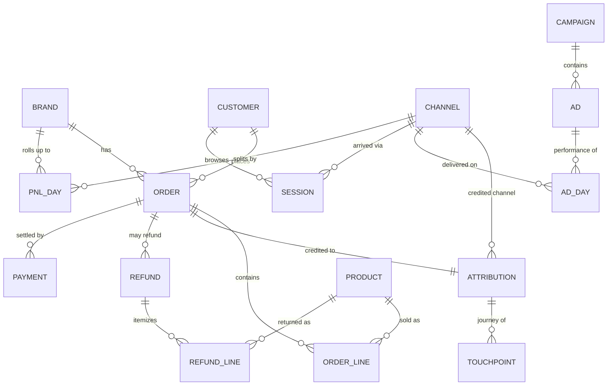

# 01 — Conceptual Model

The business, technology-agnostic: what entities exist, what questions ask about,
and the rules every answer must obey. Maps down to `02_LOGICAL_MODEL.md`.

## 1. Domains (subject areas → module scope)

Eight domains, 1:1 with the agent's module registry (`catalogue/modules.yaml`):

| Domain | Question it answers | Primary mart(s) |
|---|---|---|
| **Commerce** | What did we sell, net of returns? | mart_orders, mart_channel_daily |
| **Product** | Which SKUs sell, at what margin? | mart_order_items |
| **Attribution** | Which channel/campaign drove the sale? | mart_orders (lt_*), mart_channel_daily, mart_attribution_journey |
| **Paid Media** | How are ads delivering & performing? | mart_ads_daily, mart_ad_status |
| **Finance** | P&L — profit, COGS, ROAS, MER? | mart_pnl_daily, mart_channel_daily |
| **Customer** | Who buys, repeats, LTV? | mart_customers, mart_orders (sequence) |
| **Web / Funnel** | How do sessions convert? | mart_sessions |
| **Operations** | Returns/refunds and their cost? | mart_refunds |

## 2. Business entities

`BRAND` is the tenant; every entity is scoped by it. An entity is a business fact
regardless of where it physically lives.

## 3. Concepts — what questions ask for (28)

Questions name **concepts**, not tables. A concept resolves to one measure once its
axes are chosen (§4). Full definitions + resolves tables: `04_METRIC_CATALOGUE_AND_CONCEPTS.md`.

**Commerce / Finance:** Sales/Revenue · Orders · Profit · Margin % · COGS/Operating
Cost · Discounts · Returns/Cancels · Taxes · Contribution · AOV · ASP · Units Sold.
**Marketing:** Ad Spend · ROAS · MER · CAC · Ad Net Profit · Attributed Revenue ·
Attributed Orders · Impressions/Clicks/CTR/CPC/CPM · Reach/Frequency.
**Customer:** LTV · LTV:CAC · New/Repeat Customers · Repeat Rate.
**Web:** Sessions · Conversion Rate · Web Engagement · Attribution Quality.

## 4. Axis vocabulary (the closed set that spans every concept)

| Axis | Values (default **bold**) | Meaning |
|---|---|---|
| `basis` | **net** · gross · total | net = ex-GST after discounts/returns · gross = ex-GST pre-discount · total = incl-GST |
| `scope` | **company** · shopify · product · all_channels | company = all-channels P&L · shopify = Shopify commerce · product = SKU/line · all_channels = marketplace rollup |
| `attribution` | **none** · last_touch · channel · platform | none = commerce · last_touch = order_attribution (lt_*) · channel = closed set · platform = per-platform attribution |
| `platform` | **all** · meta · google (+ future: whatsapp…) | a *filter on the channel dimension*, not a separate metric |
| `grain` | **period** · order · daily · event · ad · campaign · adset · session · customer · hour | period = topline; finer for breakdowns |
| `time_basis` | **order_date** · event_date · report_date | reconciliation axis |

Unspecified axes take defaults and the resolver **discloses which defaults it
applied**. An axis is *asked* only when it materially changes the number and is
genuinely ambiguous — `attribution` for revenue/orders is the canonical
"disclose or ask" case (attributed vs P&L differ ~20% and do not reconcile).

## 5. The channel concept (the axis with the most confusion)

"Channel" carries **five distinct meanings**, modeled as one dimension with a typed
`channel_type` (closed) and open, data-driven `channel_value`:

| `channel_type` | Value space | Lives on |
|---|---|---|
| `attribution_closed_set` | meta / google / organic_shopify / unattributed | mart_channel_daily |
| `last_touch_fine` | ig_feed / fb_feed / google_pmax / … | mart_orders (lt_channel) |
| `marketplace` | shopify / … | mart_channel_daily (all-channels rows) |
| `funnel_fine` | ig_feed / google_search / organic / … | mart_sessions |
| `pnl_overview` | meta / google / organic / unattributed | mart_channel_daily (pnl rows) |

Hierarchy: `platform → channel → placement → ad`. A bare "by channel" resolves to
the coarse platform level (ontology default: ChannelAttribution). Extensibility
(WhatsApp, sub-channels) is handled entirely by data — see
`../../LOGICAL_DATA_MODEL_DESIGN.md §9` and `04`/`03`.

## 6. Governing business rules

1. **Grain is sacred** — a measure is valid only at its own grain; parts below don't
   re-sum to the whole (order vs line vs ad-day).
2. **Basis must be explicit** — net / gross / total; the GST boundary is the single
   largest source of wrong answers.
3. **Attribution is an axis, not a fact** — commerce, last-touch, and channel
   readings of "revenue" legitimately differ (~20%) and do **not** reconcile.
4. **Channel is a dimension, not a name** — values are data; a new channel is a row.
5. **All-channels is the topline default** — bare financial terms mean the
   all-channels P&L headline; Shopify-only needs an explicit qualifier.
6. **No silent approximation** — a request the model can't serve at the asked grain
   returns an explicit unsupported-with-reason, never a best-effort wrong join.
