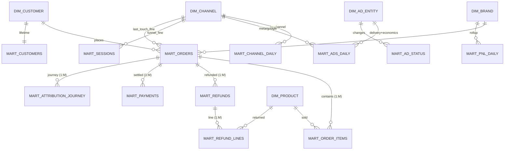

# 02 — Logical Model (the ~10 wide marts)

Every mart is one wide table at **one grain**, joins pre-resolved, channel-keyed
where relevant. Columns below are grounded in the current serve cubes (measure/
dimension names + Cube types) so nothing is invented and nothing is lost. Legend:
**PK** key part · *(m)* measure · *(d)* dimension · `→src` source view.

Conformed dimensions (shared by FK across marts): **DIM_BRAND**(brand_id),
**DIM_DATE**(date), **DIM_CUSTOMER**(customer_id), **DIM_PRODUCT**(variant_id/sku),
**DIM_AD_ENTITY**(account→campaign→adset→ad→creative), **DIM_CHANNEL**(channel_type,
channel_value; hierarchy platform→channel→placement), **DIM_PAYMENT**(payment_method/
gateway/bucket, is_cod/is_prepaid), **DIM_GEOGRAPHY**(country/region/city/pincode/state).

---

## mart_orders — brand_id × order_id

Root `commerce_orders`; fold order-events to order level; join attribution 1:1,
purchase-sequence, platform-attribution.

| Group | Columns |
|---|---|
| **PK / keys** | brand_id, order_id, order_name |
| **time** | order_date, order_created_at_ist |
| **commerce (m)** | orders, total_sales `incl-GST`, gross_sales_excl_tax, discount_amount_excl_tax, dashboard_net_sales_excl_tax, net_revenue_excl_tax, total_refund_amount, total_shipping_charged, aov, item_count |
| **order-status counts (m)** | active_orders, cod_orders, prepaid_orders, manual_orders, paytm_card_machine_orders, total_payment_orders, new_customer_orders |
| **event rollup (m)** `→commerce_order_events` | cancelled_orders, returned_orders, returns_cancels_orders, cancel_revenue_excl_tax, return_revenue_excl_tax, event_revenue_deduction_excl_tax (+ event_date, event_type only if event-grain detail kept) |
| **last-touch attribution (m/d)** `→order_attribution` (1:1) | attributed_net_revenue, attributed_gross_revenue, attributed_refund_amount, attributed_aov, attribution_confidence; lt_platform, lt_channel, lt_utm_source/medium/campaign, lt_campaign_id/name, lt_adset_name, lt_ad_name, attribution_method, attribution_model, identity_resolution_method |
| **platform attribution (m)** `→platform_attribution_commerce` (1:1) | meta_net_sales, meta_gross_sales, meta_orders, google_net_sales, google_gross_sales, google_orders (order-grain P&L split) |
| **purchase sequence (m/d)** `→purchase_sequence` | order_seq, order_seq_band, is_first_order, days_since_prev_order, first_orders, repeat_orders |
| **dims** | order_status, return_status, financial_status, fulfillment_status, pnl_refund_class, source_name, is_new_customer, is_commerce_placement_order, is_placement_active_order; FK DIM_CUSTOMER(customer_id), DIM_PAYMENT, DIM_GEOGRAPHY |

Excluded (dead): utm_source/medium/campaign (0% populated — §9.2). Fan-out: events
are 1:M → rolled to order-level sums; never expose event rows as order measures.

## mart_order_items — brand_id × order_id × line_item_id

`product_performance` as-is; optional lt_* via order (M:1→1:1).

| Group | Columns |
|---|---|
| **PK / keys** | brand_id, order_id, line_item_id |
| **time** | order_date, created_at_ist |
| **units (m)** | units_sold, gross_units_ordered, total_quantity, returned_units, cancelled_units, units_per_order |
| **revenue/cost (m)** | net_line_revenue_ex_gst, gross_line_revenue_ex_gst, total_line_discounts, product_cogs, total_cogs, product_cost_only, gross_cogs, gross_profit_ex_gst, product_gross_margin_pct, average_selling_price, product_cancel_revenue, product_return_revenue |
| **counts / dq (m)** | product_orders, line_item_count, unique_products, lines_missing_cogs, cost_coverage_pct |
| **dims** | FK DIM_PRODUCT(product_id, variant_id, sku, product_title, variant_title, product_type, vendor); order_status, return_status, pnl_refund_class, is_eligible_line, is_cost_set, is_new_customer; FK DIM_PAYMENT, DIM_GEOGRAPHY(city/region/country), source_name |

## mart_channel_daily — brand_id × report_date × channel  *(the extensible channel mart)*

Long, channel-keyed. Replaces wide `channel_pnl.meta_*/google_*/organic_*` and the
`*_all_channels` rollups. New channel (WhatsApp) = new **row**.

| Group | Columns |
|---|---|
| **PK / keys** | brand_id, report_date, channel *(FK DIM_CHANNEL)* |
| **channel dims (d)** | channel_type, source_platform, revenue_basis, attribution_model, is_unattributed |
| **volume (m)** | orders, new_customer_orders, unattributed_orders, returned_orders, cancelled_orders, returns_cancels |
| **revenue (m)** | gross_revenue, net_revenue_excl_tax, total_sales, gross_sales, net_sales, discounts, return_revenue, cancel_revenue, return_cancel_revenue |
| **economics (m)** | net_cogs, product_cost, ad_spend, net_profit |
| **ratios (m)** | net_roas, gross_roas, be_roas |
| **all-channels rollup (m)** `→sales/orders/returns_cancels_all_channels` | shopify_net_sales, shopify_total_sales, shopify_gross_sales, shopify_returns_cancels, shopify_return_cancel_revenue |

Sources unified: `channel_attribution` (orders/net_revenue by attribution channel),
`channel_pnl` (net_sales/net_profit/roas by channel — **unpivoted** from meta_*/
google_*/organic_* into channel rows), `sales/orders/returns_cancels_all_channels`
(marketplace). `channel_type` disambiguates which reading a row is.

## mart_ads_daily — brand_id × report_date × channel × campaign × adset × ad

Unified cross-platform ad delivery + economics + ad-day attribution. `channel` =
meta/google (+future). Hourly and breakdown are **grain variants** via a `grain`
partition column (`day` | `hour` | `breakdown`).

| Group | Columns |
|---|---|
| **PK / keys** | brand_id, report_date, channel, campaign_id, adset_id, ad_id (+ grain, hour_of_day, breakdown_type/dimension_1/2 for variants) |
| **spend/delivery (m) — common** | ad_spend (`meta_spend`+`google_spend`), impressions, clicks, ctr, cpc, cpm |
| **delivery (m) — meta-only, null on google** | link_clicks, landing_page_views, reach*, frequency*, video_3s/25/50/75/95/100_pct_views, thruplays, hook_rate, hold_rate_15s, video_completion_rate, cost_per_link_click, cost_per_landing_page_view |
| **economics (m)** `→ad_channel_pnl` | net_sales, gross_sales, discounts, return_revenue, cancel_revenue, product_cost, net_cogs, net_profit, orders, returned_orders, cancelled_orders, returns_cancels, net_roas, profit_roas |
| **ad-day attribution (m)** `→meta_ad_attribution` | attributed_orders, attributed_net_revenue, attributed_gross_revenue, attributed_refund_amount, attributed_aov, new_customer_orders, new_customer_revenue |
| **budgets (m, max not sum)** | adset_daily/lifetime_budget, campaign_daily/lifetime_budget |
| **ad-entity dims (d)** | FK DIM_AD_ENTITY: ad_account_id, account_name, campaign_name/status/objective/type/bid_strategy, adset_name/status/optimization_goal, ad_name/status/format/headline, creative_id/name/title/body/status/cta_type/thumbnail_url/destination_url, neurohack_tag_codes/hack_names/categories, campaign_start/end_date; row_type (detail/total), is_unattributed |
| **breakdown dims (variant only)** | age, gender, publisher_platform, platform_position, device_platform, region *(country/impression_device excluded — dead §9.2)* |

*reach, frequency, budgets are non-additive/max — never `sum`.* Excluded dead dims:
adset_type/billing_event/bid_strategy, campaign_buying_type (single-constant for
Meta — §9.2). row_type='detail' filter required before summing (fanout guard).

## mart_pnl_daily — brand_id × report_date  *(P&L spine)*

`canonical_pnl` + `finance_waterfall` + `ltv_cac`.

| Group | Columns |
|---|---|
| **PK** | brand_id, report_date |
| **sales (m)** | orders, net_sales, gross_sales, discounts, cancel_revenue, return_revenue, taxes_on_net_sales, net_sales_all_channels_pnl |
| **cost (m)** | net_cogs, total_operating_cost, product_cost, operating_cost, shipping_cost, packaging_cost, payment_gateway_fees, rto_cost, product_cost_all_channels, total_operating_cost_all_channels |
| **spend (m)** | meta_spend, google_spend, total_ad_spend, shopify_ad_spend *(per-channel spend = compat, derived from mart_channel_daily)* |
| **profit (m)** | gross_profit, contribution_margin, net_profit, net_profit_shopify, net_profit_all_channels |
| **ratios (m)** | gross_margin_pct, contribution_margin_pct, net_margin_pct, mer, mer_all_channels, net_roas, net_roas_all_channels, gross_roas, gross_roas_all_channels, be_roas, be_roas_all_channels, cost_coverage_pct |
| **waterfall (m)** `→finance_waterfall` | line_gmv, line_net_revenue_excl_gst, line_net_cogs, line_gross_profit, line_net_profit, line_marketing (+ waterfall_key d) |
| **ltv:cac (m)** `→ltv_cac` | new_customers, new_customer_revenue, ltv, cac, ltv_cac_ratio |

Identities preserved: net_cogs = product_cost + operating_cost; gross_profit =
net_sales − net_cogs; net_profit = contribution_margin − total_ad_spend.

## mart_customers — brand_id × customer_id

`customer_ltv` + `customer_data`.

| Group | Columns |
|---|---|
| **PK** | brand_id, customer_id, email_hash |
| **lifetime (m)** | customers, repeat_customers, marketing_opt_in_customers, lifetime_net_revenue, lifetime_gross_revenue, lifetime_orders, avg_ltv, repeat_rate, avg_orders_per_customer, avg_days_since_last_order |
| **acquisition (d)** | acquisition_platform, acquisition_channel, acquisition_campaign, first_order_product, first_order_at, last_order_at |
| **profile (d)** | account_state, email_marketing_state, sms_marketing_state, default_city, default_province, default_country, is_repeat_customer, lifetime_order_count_band |

Excluded dead: accepts_marketing (constant 0 — §9.2).

## mart_sessions — brand_id × session_id   ·   mart_sessions_daily — brand_id × report_date × channel

Session grain from `session_funnel`; daily rollup folds `funnel_daily` +
`web_events_daily`.

| mart_sessions (m) | sessions, engaged_sessions, bounce_sessions, pdp/atc/checkout/purchased_sessions, purchase_revenue, product_views, add_to_carts, remove_from_carts, checkout_steps, site_searches, page_views, conversion_rate, pdp/atc/checkout_rate, atc_to_checkout_rate, checkout_to_purchase_rate, bounce_rate, engaged_rate, avg_seconds_to_add_to_cart/checkout/purchase, avg_page_depth |
|---|---|
| **dims** | FK DIM_CHANNEL(channel, channel_type=funnel_fine), funnel_stage, converted, shopify_order_id, landing_page_resolved, geo_city/region/country, session_date, session_hour, session_day_of_week, identity_resolution_method, FK DIM_AD_ENTITY(campaign/adset/ad) |
| **mart_sessions_daily (m)** | sessions, pdp/atc/checkout/converted_sessions, purchases, revenue, funnel_conversion_rate, bounce_rate + web_events_daily: events, page_views, product_views, collection_views, add_to_cart_events, site_search_events, purchase_events |

Excluded dead: device_type, browser_family, os_family, utm_* (0% populated — §9.2).
Event-grain `web_events` detail (page_path, product_id, sku) is an optional
`mart_web_events` variant if event-level questions are needed.

## mart_refunds — brand_id × refund_id   ·   mart_refund_lines — brand_id × refund_line_item_id

`refund_events` (refund grain) + `return_lifecycle` (line grain).

| mart_refunds (m) | refund_count, refunded_amount, refunded_amount_excl_tax, returns_excl_tax, refunded_quantity, restocked_refunds, money_refunds, avg_refund_value, restock_rate |
|---|---|
| **dims** | order_id, refund_date, order_date, pnl_refund_class, return_status/primary/shopify_return_status, order_status, payment_status, restock, is_unprocessed, FK DIM_PAYMENT, DIM_GEOGRAPHY |
| **mart_refund_lines (m)** | refund_lines, refunded_units, refunded_amount_excl_tax, recovered_product_cost, recovered_packaging_cost, recovered_shipping_cost, recovered_gateway_fee, rto_cost_refund, recovered_cogs, avg_refund_per_unit |
| **line dims** | refund_id, order_id, FK DIM_PRODUCT(sku, product_title, variant_title), restock_type, pnl_refund_class, is_cost_set |

## mart_payments — brand_id × transaction_id

`payments`. Measures: transactions, payment_amount, amount_signed,
successful_transactions. Dims: order_id, transaction_date, transaction_created_at,
transaction_kind, transaction_status, is_refund, FK DIM_PAYMENT.

## mart_ad_status — brand_id × entity_type × entity_id × changed_at

`meta_ads_status_history` + `google_ads_status_history` unified (add `channel`).
Measures: status_events, status_changes, budget_changes. Dims: channel, campaign_id,
adset_id/adgroup_id, ad_id, entity_name, status, prev_status, effective_status,
bidding_strategy_type.

## mart_attribution_journey — brand_id × order_id × touch_id  *(optional)*

`touchpoints` + `attribution_paths`. Measures: touches, distinct_orders,
avg_touch_count, touch_count. Dims: touch_ts, touch_sequence, lt_platform, lt_channel,
channel_source/medium/campaign, attribution_model, conversion_path.

---

## Master relationships

**Fan-out rule:** a mart pulls 1:1 / M:1 attributes freely; it must never expose a
measure reached across 1:M without pre-grouping (order↔items, order↔events,
order↔payments/refunds). Rollup marts (`mart_channel_daily`, `mart_pnl_daily`,
`mart_sessions_daily`) are pre-aggregated to their grain.

Concept → mart.measure binding: `04_METRIC_CATALOGUE_AND_CONCEPTS.md`.
Physical DDL, keys, materialization, cube mapping: `03_PHYSICAL_MODEL.md`.
